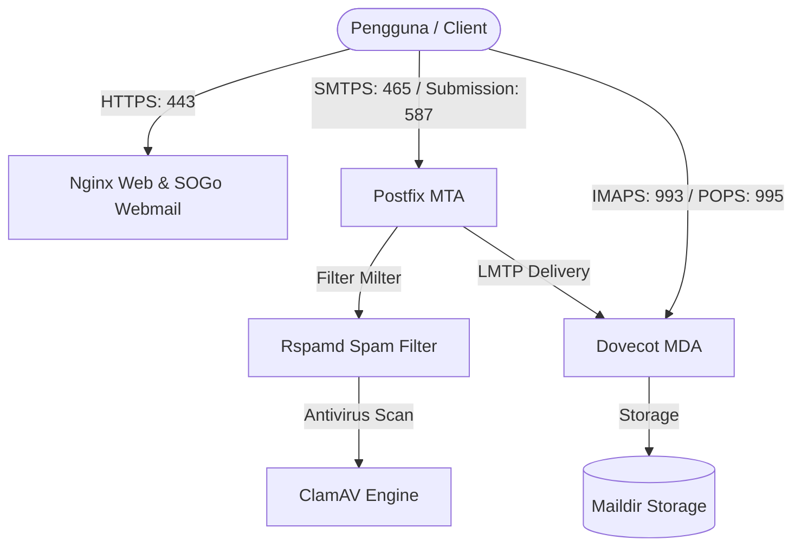

# 🐮 Mailcow Dockerized — Mail Server Pemerintah Kota Tebing Tinggi

Dokumentasi konfigurasi, instalasi, dan pemeliharaan Mail Server **Pemerintah Kota Tebing Tinggi** berbasis **Mailcow: dockerized**.

- **FQDN / Hostname Mail Server**: `mail.tebingtinggikota.go.id`
- **Domain Email Utama**: `tebingtinggikota.go.id`
- **Sertifikat SSL Aktif**: GlobalSign AlphaSSL Wildcard (`*.tebingtinggikota.go.id`)

---

## 📋 Daftar Isi
1. [Spesifikasi & Konfigurasi DNS](#1-spesifikasi--konfigurasi-dns)
2. [Arsitektur & Port Service](#2-arsitektur--port-service)
3. [Konfigurasi mailcow.conf](#3-konfigurasi-mailcowconf)
4. [Konfigurasi SSL Wildcard (GlobalSign)](#4-konfigurasi-ssl-wildcard-globalsign)
5. [Langkah Instalasi & Menjalankan Service](#5-langkah-instalasi--menjalankan-service)
6. [Akses Webmail & Panel Admin](#6-akses-webmail--panel-admin)
7. [Panduan Operasional & Backup](#7-panduan-operasional--backup)
8. [Troubleshooting & Best Practices](#8-troubleshooting--best-practices)

---

## 1. Spesifikasi & Konfigurasi DNS

Pastikan seluruh record DNS untuk domain `tebingtinggikota.go.id` telah diarahkan dengan benar pada DNS Management / Cloudflare:

| Tipe Record | Nama Host / Subdomain | Nilai / Target | Prioritas | Keterangan |
| :--- | :--- | :--- | :--- | :--- |
| **A** | `mail.tebingtinggikota.go.id` | `<IP_PUBLIC_SERVER>` | - | IP Publik Server Mailcow |
| **MX** | `tebingtinggikota.go.id` | `mail.tebingtinggikota.go.id` | `10` | Mengarahkan email masuk ke server ini |
| **CNAME** | `autodiscover.tebingtinggikota.go.id` | `mail.tebingtinggikota.go.id` | - | Otomasi deteksi client (Outlook/iOS/Android) |
| **CNAME** | `autoconfig.tebingtinggikota.go.id` | `mail.tebingtinggikota.go.id` | - | Otomasi deteksi client (Thunderbird) |
| **TXT (SPF)**| `tebingtinggikota.go.id` | `"v=spf1 mx a:mail.tebingtinggikota.go.id ~all"` | - | Otorisasi pengirim email dari server |
| **TXT (DKIM)**| `dkim._domainkey.tebingtinggikota.go.id` | `"v=DKIM1; k=rsa; p=..."` | - | Didapat dari Panel Admin Mailcow (Configuration > ARC/DKIM Keys) |
| **TXT (DMARC)**| `_dmarc.tebingtinggikota.go.id` | `"v=DMARC1; p=quarantine; rua=mailto:postmaster@tebingtinggikota.go.id"` | - | Kebijakan proteksi spam/spoofing |
| **PTR (rDNS)**| `<IP_PUBLIC_SERVER>` | `mail.tebingtinggikota.go.id` | - | **Wajib** disetting di penyedia VPS/ISP |

---

## 2. Arsitektur & Port Service

Port-port berikut berjalan di container Docker dan harus dibuka pada Firewall / Security Group:



| Port | Protokol | Service | Keterangan |
| :--- | :--- | :--- | :--- |
| **25** | TCP | Postfix (SMTP) | Komunikasi email masuk/keluar antar mail server |
| **465** | TCP | Postfix (SMTPS) | Pengiriman email klien via SSL/TLS |
| **587** | TCP | Postfix (Submission) | Pengiriman email klien via STARTTLS |
| **993** | TCP | Dovecot (IMAPS) | Akses inbox via IMAP SSL/TLS |
| **143** | TCP | Dovecot (IMAP) | Akses inbox via IMAP STARTTLS |
| **995** | TCP | Dovecot (POPS) | Akses inbox via POP3 SSL/TLS |
| **4190** | TCP | Dovecot (ManageSieve) | Pengelolaan aturan & filter pesan |
| **80** | TCP | Nginx (HTTP) | Redirect otomatis ke HTTPS (port 443) |
| **443** | TCP | Nginx (HTTPS) | Webmail SOGo & Panel Admin Mailcow UI |

---

## 3. Konfigurasi `mailcow.conf`

File `mailcow.conf` telah disesuaikan khusus untuk lingkungan `tebingtinggikota.go.id`:

```ini
# Hostname FQDN Mail Server
MAILCOW_HOSTNAME=mail.tebingtinggikota.go.id

# Hash Password
MAILCOW_PASS_SCHEME=BLF-CRYPT

# Database & Cache
DBNAME=mailcow
DBUSER=mailcow

# HTTP / HTTPS Port
HTTP_PORT=80
HTTPS_PORT=443
HTTP_REDIRECT=y

# SSL Let's Encrypt dilewati karena menggunakan GlobalSign Wildcard
SKIP_LETS_ENCRYPT=y

# Service Optimization
SKIP_CLAMD=n
SKIP_FTS=n
SKIP_SOGO=n
USE_WATCHDOG=y
```

---

## 4. Konfigurasi SSL Wildcard (GlobalSign)

Server ini menggunakan sertifikat SSL Wildcard GlobalSign AlphaSSL:
- **Common Name (CN)**: `*.tebingtinggikota.go.id` & `tebingtinggikota.go.id`
- **Lokasi File Sertifikat di Server**:
  - Fullchain Certificate: `data/assets/ssl/cert.pem`
  - Private Key: `data/assets/ssl/key.pem`
  - Diffie-Hellman Params: `data/assets/ssl/dhparams.pem`

Sertifikat ini otomatis digunakan oleh:
1. **Nginx** (`https://mail.tebingtinggikota.go.id`)
2. **Postfix** (SMTPS port 465, STARTTLS port 587 & 25)
3. **Dovecot** (IMAPS port 993, POPS port 995)

> 💡 **Pembaruan SSL di masa mendatang**: Cukup timpa file `data/assets/ssl/cert.pem` dan `data/assets/ssl/key.pem` lalu jalankan:
> ```bash
> docker compose restart nginx-mailcow postfix-mailcow dovecot-mailcow
> ```

---

## 5. Langkah Instalasi & Menjalankan Service

Jika menjalankan ulang atau mendeploy pada instance baru:

```bash
# 1. Masuk ke direktori
cd /opt/mailcow-dockerized

# 2. Tarik image container terbaru
docker compose pull

# 3. Jalankan semua service Mailcow di background
docker compose up -d

# 4. Cek status seluruh service (pastikan semua "Up")
docker compose ps
```

---

## 6. Akses Webmail & Panel Admin

### A. Panel Admin Mailcow
- **URL**: `https://mail.tebingtinggikota.go.id`
- **Default Username**: `admin`
- **Default Password**: `moohoo`
- **Langkah Setelah Login**:
  1. Masuk menu **Configuration** > **Admin Accounts** > Ganti password default `admin`.
  2. Masuk menu **Configuration** > **Mail Setup** > Tambahkan Domain `tebingtinggikota.go.id`.
  3. Buat Mailbox baru (contoh: `diskominfo@tebingtinggikota.go.id`, `sekda@tebingtinggikota.go.id`).
  4. Masuk menu **Configuration** > **ARC/DKIM Keys** > Generate DKIM key untuk domain `tebingtinggikota.go.id` (Key length 2048) lalu salin public key ke DNS TXT Record.

### B. Webmail Pengguna (SOGo)
- **URL**: `https://mail.tebingtinggikota.go.id`
- **Login**: Menggunakan alamat email lengkap (contoh: `nama.pegawai@tebingtinggikota.go.id`) dan password masing-masing.
- **Fitur**: Email, Kontak, Kalender, Pengaturan Auto-Reply (Out of Office), dan Spam Filter kustom.

---

## 7. Panduan Operasional & Backup

### Monitoring & Log
```bash
# Melihat log realtime pengiriman email (Postfix)
docker compose logs -f postfix-mailcow

# Melihat log antispam (Rspamd)
docker compose logs -f rspamd-mailcow

# Melihat log login IMAP/POP3 (Dovecot)
docker compose logs -f dovecot-mailcow
```

### Prosedur Backup & Restore
```bash
# Melakukan backup lengkap (database MariaDB, vmail, vmail index, dan SOGo)
BACKUP_LOCATION=/var/backups/mailcow ./helper-scripts/backup_and_restore.sh backup all

# Melakukan restore data dari cadangan
BACKUP_LOCATION=/var/backups/mailcow ./helper-scripts/backup_and_restore.sh restore
```

### Reset Password Admin
Jika sewaktu-waktu lupa password akun `admin`:
```bash
./helper-scripts/mailcow-reset-admin.sh
```

---

## 8. Troubleshooting & Best Practices

1. **Email Masuk Masuk Spam / Ditolak**:
   - Pastikan rDNS / PTR dari IP publik server adalah `mail.tebingtinggikota.go.id`.
   - Pastikan DKIM selector `dkim._domainkey.tebingtinggikota.go.id` sudah terdaftar dan aktif.
   - Uji skor email via [mail-tester.com](https://www.mail-tester.com).

2. **Kustomisasi Tampilan Webmail SOGo**:
   - Judul halaman diatur pada `data/conf/sogo/sogo.conf` (`SOGoPageTitle = "Pemerintah Kota Tebing Tinggi";`).
   - Logo kustom diletakkan pada:
     - `data/conf/sogo/custom-fulllogo.png` / `custom-fulllogo.svg`
     - `data/conf/sogo/custom-favicon.ico`

3. **Restart Service Spesifik**:
   ```bash
   docker compose restart sogo-mailcow
   docker compose restart postfix-mailcow
   docker compose restart dovecot-mailcow
   ```
